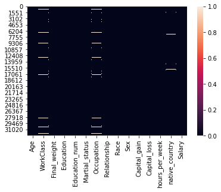
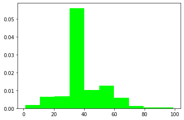
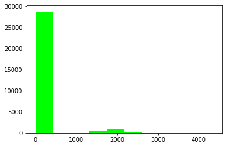
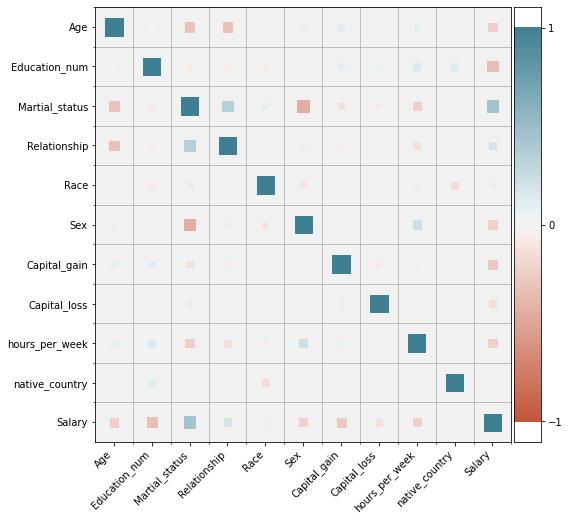
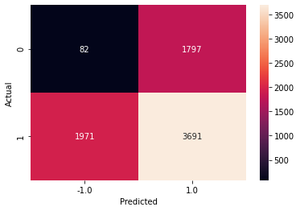
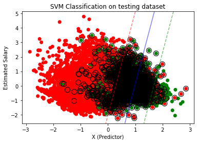
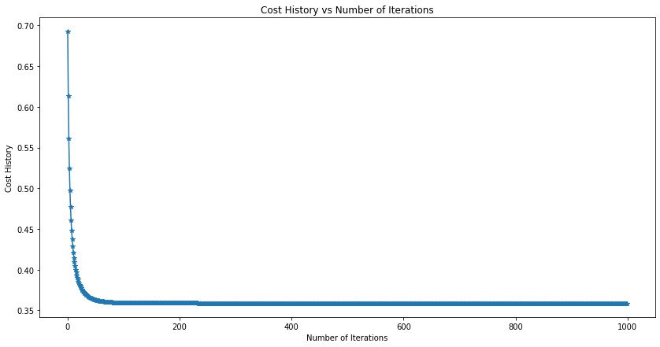

The aim of the following Project is to predict whether income of a person exceeds
$50K/year based on Adult dataset. <!--more-->
```python
from google.colab import drive
drive.mount('/content/drive')
```

Mounted at /content/drive


## Importing the Libraries
```python
import numpy as np
import pandas as pd
import statsmodels.api as sm
from math import exp
import scipy.optimize as opt
import matplotlib.animation as animation
import math
from sklearn.model_selection import train_test_split
from sklearn.metrics import accuracy_score, recall_score, precision_score
from sklearn.utils import shuffle
import matplotlib.pyplot as plt
```

/usr/local/lib/python3.7/dist-packages/statsmodels/tools/_testing.py:19: FutureWarning: pandas.util.testing is deprecated. Use the functions in the public API at pandas.testing instead.
```python
import pandas.util.testing as tm
```

## Loading the Data


```Python
fit = pd.read_csv('/content/drive/My Drive/Machine Learning/adult_data.csv',na_values='?')
```


```python
data=[fit]
```


```python
fit
```


|       | Age | WorkClass        | Final_weight | Education  | Education_num | Martial_status     | Occupation        | Relationship  | Race  | Sex    | Capital_gain | Capital_loss | hours_per_week | native_country | Salary |
|-------|-----|------------------|--------------|------------|---------------|--------------------|-------------------|---------------|-------|--------|--------------|--------------|----------------|----------------|--------|
| 0     | 39  | State-gov        | 77516        | Bachelors  | 13            | Never-married      | Adm-clerical      | Not-in-family | White | Male   | 2174         | 0            | 40             | United-States  | <=50K  |
| 1     | 50  | Self-emp-not-inc | 83311        | Bachelors  | 13            | Married-civ-spouse | Exec-managerial   | Husband       | White | Male   | 0            | 0            | 13             | United-States  | <=50K  |
| 2     | 38  | Private          | 215646       | HS-grad    | 9             | Divorced           | Handlers-cleaners | Not-in-family | White | Male   | 0            | 0            | 40             | United-States  | <=50K  |
| 3     | 53  | Private          | 234721       | 11th       | 7             | Married-civ-spouse | Handlers-cleaners | Husband       | Black | Male   | 0            | 0            | 40             | United-States  | <=50K  |
| 4     | 28  | Private          | 338409       | Bachelors  | 13            | Married-civ-spouse | Prof-specialty    | Wife          | Black | Female | 0            | 0            | 40             | Cuba           | <=50K  |
| ...   | ... | ...              | ...          | ...        | ...           | ...                | ...               | ...           | ...   | ...    | ...          | ...          | ...            | ...            | ...    |
| 32556 | 27  | Private          | 257302       | Assoc-acdm | 12            | Married-civ-spouse | Tech-support      | Wife          | White | Female | 0            | 0            | 38             | United-States  | <=50K  |
| 32557 | 40  | Private          | 154374       | HS-grad    | 9             | Married-civ-spouse | Machine-op-inspct | Husband       | White | Male   | 0            | 0            | 40             | United-States  | >50K   |
| 32558 | 58  | Private          | 151910       | HS-grad    | 9             | Widowed            | Adm-clerical      | Unmarried     | White | Female | 0            | 0            | 40             | United-States  | <=50K  |
| 32559 | 22  | Private          | 201490       | HS-grad    | 9             | Never-married      | Adm-clerical      | Own-child     | White | Male   | 0            | 0            | 20             | United-States  | <=50K  |
| 32560 | 52  | Self-emp-inc     | 287927       | HS-grad    | 9             | Married-civ-spouse | Exec-managerial   | Wife          | White | Female | 15024        | 0            | 40             | United-States  | >50K   |


```python
fit['WorkClass'].value_counts()
```


    Private             22696
    Self-emp-not-inc     2541
    Local-gov            2093
    ?                    1836
    State-gov            1298
    Self-emp-inc         1116
    Federal-gov           960
    Without-pay            14
    Never-worked            7
    Name: WorkClass, dtype: int64


```python
fit= fit.replace('[?]', np.nan, regex=True)
print(fit[25:40])
```


        Age          WorkClass  ...  native_country  Salary
    25   56          Local-gov  ...   United-States    >50K
    26   19            Private  ...   United-States   <=50K
    27   54                NaN  ...           South    >50K
    28   39            Private  ...   United-States   <=50K
    29   49            Private  ...   United-States   <=50K
    30   23          Local-gov  ...   United-States   <=50K
    31   20            Private  ...   United-States   <=50K
    32   45            Private  ...   United-States   <=50K
    33   30        Federal-gov  ...   United-States   <=50K
    34   22          State-gov  ...   United-States   <=50K
    35   48            Private  ...     Puerto-Rico   <=50K
    36   21            Private  ...   United-States   <=50K
    37   19            Private  ...   United-States   <=50K
    38   31            Private  ...             NaN    >50K
    39   48   Self-emp-not-inc  ...   United-States   <=50K

    [15 rows x 15 columns]


```python
from collections import Counter
```


```python3
# summarize the class distribution
target = fit.values[:,-1]
counter = Counter(target)
for k,v in counter.items():
	per = v / len(target) * 100
	print('Class=%s, Count=%d, Percentage=%.3f%%' % (k, v, per))
```

    Class= <=50K, Count=24720, Percentage=75.919%
    Class= >50K, Count=7841, Percentage=24.081%


```python
import seaborn as sns
```


```python
sns.heatmap(fit.isna(), cbar=True,)
```


    <matplotlib.axes._subplots.AxesSubplot at 0x7f455550f978>





## Dropping NA values


```python
fit = fit.dropna()
fit
```

|       | Age | WorkClass        | Final_weight | Education  | Education_num | Martial_status     | Occupation        | Relationship  | Race  | Sex    | Capital_gain | Capital_loss | hours_per_week | native_country | Salary |
|-------|-----|------------------|--------------|------------|---------------|--------------------|-------------------|---------------|-------|--------|--------------|--------------|----------------|----------------|--------|
| 0     | 39  | State-gov        | 77516        | Bachelors  | 13            | Never-married      | Adm-clerical      | Not-in-family | White | Male   | 2174         | 0            | 40             | United-States  | <=50K  |
| 1     | 50  | Self-emp-not-inc | 83311        | Bachelors  | 13            | Married-civ-spouse | Exec-managerial   | Husband       | White | Male   | 0            | 0            | 13             | United-States  | <=50K  |
| 2     | 38  | Private          | 215646       | HS-grad    | 9             | Divorced           | Handlers-cleaners | Not-in-family | White | Male   | 0            | 0            | 40             | United-States  | <=50K  |
| 3     | 53  | Private          | 234721       | 11th       | 7             | Married-civ-spouse | Handlers-cleaners | Husband       | Black | Male   | 0            | 0            | 40             | United-States  | <=50K  |
| 4     | 28  | Private          | 338409       | Bachelors  | 13            | Married-civ-spouse | Prof-specialty    | Wife          | Black | Female | 0            | 0            | 40             | Cuba           | <=50K  |
| ...   | ... | ...              | ...          | ...        | ...           | ...                | ...               | ...           | ...   | ...    | ...          | ...          | ...            | ...            | ...    |
| 32556 | 27  | Private          | 257302       | Assoc-acdm | 12            | Married-civ-spouse | Tech-support      | Wife          | White | Female | 0            | 0            | 38             | United-States  | <=50K  |
| 32557 | 40  | Private          | 154374       | HS-grad    | 9             | Married-civ-spouse | Machine-op-inspct | Husband       | White | Male   | 0            | 0            | 40             | United-States  | >50K   |
| 32558 | 58  | Private          | 151910       | HS-grad    | 9             | Widowed            | Adm-clerical      | Unmarried     | White | Female | 0            | 0            | 40             | United-States  | <=50K  |
| 32559 | 22  | Private          | 201490       | HS-grad    | 9             | Never-married      | Adm-clerical      | Own-child     | White | Male   | 0            | 0            | 20             | United-States  | <=50K  |
| 32560 | 52  | Self-emp-inc     | 287927       | HS-grad    | 9             | Married-civ-spouse | Exec-managerial   | Wife          | White | Female | 15024        | 0            | 40             | United-States  | >50K   |


```python
fit['Salary'].value_counts()
```


     <=50K    22654
     >50K      7508
    Name: Salary, dtype: int64


```python
!pip install heatmapz
```

    Collecting heatmapz
      Downloading https://files.pythonhosted.org/packages/26/5d/3928028fcb8de3bf09bb17975ca7e83f8b2f00cd28c10bc1150f8c418372/heatmapz-0.0.4-py3-none-any.whl
    Requirement already satisfied: matplotlib>=3.0.3 in /usr/local/lib/python3.6/dist-packages (from heatmapz) (3.2.1)
    Requirement already satisfied: pandas in /usr/local/lib/python3.6/dist-packages (from heatmapz) (1.0.3)
    Requirement already satisfied: seaborn in /usr/local/lib/python3.6/dist-packages (from heatmapz) (0.10.1)
    Requirement already satisfied: numpy>=1.11 in /usr/local/lib/python3.6/dist-packages (from matplotlib>=3.0.3->heatmapz) (1.18.4)
    Requirement already satisfied: python-dateutil>=2.1 in /usr/local/lib/python3.6/dist-packages (from matplotlib>=3.0.3->heatmapz) (2.8.1)
    Requirement already satisfied: pyparsing!=2.0.4,!=2.1.2,!=2.1.6,>=2.0.1 in /usr/local/lib/python3.6/dist-packages (from matplotlib>=3.0.3->heatmapz) (2.4.7)
    Requirement already satisfied: kiwisolver>=1.0.1 in /usr/local/lib/python3.6/dist-packages (from matplotlib>=3.0.3->heatmapz) (1.2.0)
    Requirement already satisfied: cycler>=0.10 in /usr/local/lib/python3.6/dist-packages (from matplotlib>=3.0.3->heatmapz) (0.10.0)
    Requirement already satisfied: pytz>=2017.2 in /usr/local/lib/python3.6/dist-packages (from pandas->heatmapz) (2018.9)
    Requirement already satisfied: scipy>=1.0.1 in /usr/local/lib/python3.6/dist-packages (from seaborn->heatmapz) (1.4.1)
    Requirement already satisfied: six>=1.5 in /usr/local/lib/python3.6/dist-packages (from python-dateutil>=2.1->matplotlib>=3.0.3->heatmapz) (1.12.0)
    Installing collected packages: heatmapz
    Successfully installed heatmapz-0.0.4


## Converting Salary to 0 and 1
```python
# Converting Salary to 0 and 1
salary_map={' <=50K':1,' >50K':0}
fit['Salary']=fit['Salary'].map(salary_map).astype(int)
fit['Salary'].head(10)
```


    0    1
    1    1
    2    1
    3    1
    4    1
    5    1
    6    1
    7    0
    8    0
    9    0
    Name: Salary, dtype: int64


```python
# Converting Sex to integer
fit['Sex'] = fit['Sex'].map({' Male':1,' Female':0}).astype(int)
```


```python
print (fit.head(10))
print (("-"*40))
print (fit.info())
```

       Age          WorkClass  Final_weight  ... hours_per_week  native_country Salary
    0   39          State-gov         77516  ...             40   United-States      1
    1   50   Self-emp-not-inc         83311  ...             13   United-States      1
    2   38            Private        215646  ...             40   United-States      1
    3   53            Private        234721  ...             40   United-States      1
    4   28            Private        338409  ...             40            Cuba      1
    5   37            Private        284582  ...             40   United-States      1
    6   49            Private        160187  ...             16         Jamaica      1
    7   52   Self-emp-not-inc        209642  ...             45   United-States      0
    8   31            Private         45781  ...             50   United-States      0
    9   42            Private        159449  ...             40   United-States      0

    [10 rows x 15 columns]
    ----------------------------------------
    <class 'pandas.core.frame.DataFrame'>
    Int64Index: 30162 entries, 0 to 32560
    Data columns (total 15 columns):
     #   Column          Non-Null Count  Dtype
    ---  ------          --------------  -----
     0   Age             30162 non-null  int64
     1   WorkClass       30162 non-null  object
     2   Final_weight    30162 non-null  int64
     3   Education       30162 non-null  object
     4   Education_num   30162 non-null  int64
     5   Martial_status  30162 non-null  object
     6   Occupation      30162 non-null  object
     7   Relationship    30162 non-null  object
     8   Race            30162 non-null  object
     9   Sex             30162 non-null  int64
     10  Capital_gain    30162 non-null  int64
     11  Capital_loss    30162 non-null  int64
     12  hours_per_week  30162 non-null  int64
     13  native_country  30162 non-null  object
     14  Salary          30162 non-null  int64
    dtypes: int64(8), object(7)
    memory usage: 3.7+ MB
    None


```python
# Categorize between US and Non -Us
fit['native_country'].unique()
```


    array([' United-States', ' Cuba', ' Jamaica', ' India', ' Mexico',
           ' Puerto-Rico', ' Honduras', ' England', ' Canada', ' Germany',
           ' Iran', ' Philippines', ' Poland', ' Columbia', ' Cambodia',
           ' Thailand', ' Ecuador', ' Laos', ' Taiwan', ' Haiti', ' Portugal',
           ' Dominican-Republic', ' El-Salvador', ' France', ' Guatemala',
           ' Italy', ' China', ' South', ' Japan', ' Yugoslavia', ' Peru',
           ' Outlying-US(Guam-USVI-etc)', ' Scotland', ' Trinadad&Tobago',
           ' Greece', ' Nicaragua', ' Vietnam', ' Hong', ' Ireland',
           ' Hungary', ' Holand-Netherlands'], dtype=object)


```python
data=[fit]
```


```python
for dataset in data:
    dataset.loc[dataset['native_country'] != ' United-States', 'native_country'] = 'Non-US'
    dataset.loc[dataset['native_country'] == ' United-States', 'native_country'] = 'US'
```


```python
fit
```


```python
fit['native_country'] = fit['native_country'].map({'US':1,'Non-US':0}).astype(int)
fit['native_country'].head(10)
```


    0    1
    1    1
    2    1
    3    1
    4    0
    5    1
    6    0
    7    1
    8    1
    9    1
    Name: native_country, dtype: int64


## Converting Martial status into numerical


```python
fit['Martial_status'] = fit['Martial_status'].replace([' Divorced',
                                                       ' Married-spouse-absent',
                                                       ' Never-married',
                                                       ' Separated',
                                                       ' Widowed'],
                                                      'Single')
fit['Martial_status'] = fit['Martial_status'].replace([' Married-AF-spouse',' Married-civ-spouse'],'Couple')
```


```python
fit['Martial_status'].head(10)
```


    0    Single
    1    Couple
    2    Single
    3    Couple
    4    Couple
    5    Couple
    6    Single
    7    Couple
    8    Single
    9    Couple
    Name: Martial_status, dtype: object


```python
fit['Martial_status'] = fit['Martial_status'].map({'Couple':0,'Single':1})
fit.Martial_status.head(10)
```


    0    1
    1    0
    2    1
    3    0
    4    0
    5    0
    6    1
    7    0
    8    1
    9    0
    Name: Martial_status, dtype: int64


## Converting Relationship to Numerical


```python
fit[['Martial_status','Relationship','Salary']].groupby(['Relationship','Martial_status']).mean()
```


```python
rel_map = {' Unmarried':0,' Wife':1,' Husband':2,' Not-in-family':3,' Own-child':4,' Other-relative':5}
```


```
fit['Relationship'] =fit['Relationship'].map(rel_map)
```


```
fit.head(10)
```


<div>
<style scoped>
    .dataframe tbody tr th:only-of-type {
        vertical-align: middle;
    }

    .dataframe tbody tr th {
        vertical-align: top;
    }

    .dataframe thead th {
        text-align: right;
    }
</style>
<table border="1" class="dataframe">
  <thead>
    <tr style="text-align: right;">
      <th></th>
      <th>Age</th>
      <th>WorkClass</th>
      <th>Final_weight</th>
      <th>Education</th>
      <th>Education_num</th>
      <th>Martial_status</th>
      <th>Occupation</th>
      <th>Relationship</th>
      <th>Race</th>
      <th>Sex</th>
      <th>Capital_gain</th>
      <th>Capital_loss</th>
      <th>hours_per_week</th>
      <th>native_country</th>
      <th>Salary</th>
    </tr>
  </thead>
  <tbody>
    <tr>
      <th>0</th>
      <td>39</td>
      <td>State-gov</td>
      <td>77516</td>
      <td>Bachelors</td>
      <td>13</td>
      <td>1</td>
      <td>Adm-clerical</td>
      <td>3</td>
      <td>White</td>
      <td>1</td>
      <td>2174</td>
      <td>0</td>
      <td>40</td>
      <td>1</td>
      <td>1</td>
    </tr>
    <tr>
      <th>1</th>
      <td>50</td>
      <td>Self-emp-not-inc</td>
      <td>83311</td>
      <td>Bachelors</td>
      <td>13</td>
      <td>0</td>
      <td>Exec-managerial</td>
      <td>2</td>
      <td>White</td>
      <td>1</td>
      <td>0</td>
      <td>0</td>
      <td>13</td>
      <td>1</td>
      <td>1</td>
    </tr>
    <tr>
      <th>2</th>
      <td>38</td>
      <td>Private</td>
      <td>215646</td>
      <td>HS-grad</td>
      <td>9</td>
      <td>1</td>
      <td>Handlers-cleaners</td>
      <td>3</td>
      <td>White</td>
      <td>1</td>
      <td>0</td>
      <td>0</td>
      <td>40</td>
      <td>1</td>
      <td>1</td>
    </tr>
    <tr>
      <th>3</th>
      <td>53</td>
      <td>Private</td>
      <td>234721</td>
      <td>11th</td>
      <td>7</td>
      <td>0</td>
      <td>Handlers-cleaners</td>
      <td>2</td>
      <td>Black</td>
      <td>1</td>
      <td>0</td>
      <td>0</td>
      <td>40</td>
      <td>1</td>
      <td>1</td>
    </tr>
    <tr>
      <th>4</th>
      <td>28</td>
      <td>Private</td>
      <td>338409</td>
      <td>Bachelors</td>
      <td>13</td>
      <td>0</td>
      <td>Prof-specialty</td>
      <td>1</td>
      <td>Black</td>
      <td>0</td>
      <td>0</td>
      <td>0</td>
      <td>40</td>
      <td>0</td>
      <td>1</td>
    </tr>
    <tr>
      <th>5</th>
      <td>37</td>
      <td>Private</td>
      <td>284582</td>
      <td>Masters</td>
      <td>14</td>
      <td>0</td>
      <td>Exec-managerial</td>
      <td>1</td>
      <td>White</td>
      <td>0</td>
      <td>0</td>
      <td>0</td>
      <td>40</td>
      <td>1</td>
      <td>1</td>
    </tr>
    <tr>
      <th>6</th>
      <td>49</td>
      <td>Private</td>
      <td>160187</td>
      <td>9th</td>
      <td>5</td>
      <td>1</td>
      <td>Other-service</td>
      <td>3</td>
      <td>Black</td>
      <td>0</td>
      <td>0</td>
      <td>0</td>
      <td>16</td>
      <td>0</td>
      <td>1</td>
    </tr>
    <tr>
      <th>7</th>
      <td>52</td>
      <td>Self-emp-not-inc</td>
      <td>209642</td>
      <td>HS-grad</td>
      <td>9</td>
      <td>0</td>
      <td>Exec-managerial</td>
      <td>2</td>
      <td>White</td>
      <td>1</td>
      <td>0</td>
      <td>0</td>
      <td>45</td>
      <td>1</td>
      <td>0</td>
    </tr>
    <tr>
      <th>8</th>
      <td>31</td>
      <td>Private</td>
      <td>45781</td>
      <td>Masters</td>
      <td>14</td>
      <td>1</td>
      <td>Prof-specialty</td>
      <td>3</td>
      <td>White</td>
      <td>0</td>
      <td>14084</td>
      <td>0</td>
      <td>50</td>
      <td>1</td>
      <td>0</td>
    </tr>
    <tr>
      <th>9</th>
      <td>42</td>
      <td>Private</td>
      <td>159449</td>
      <td>Bachelors</td>
      <td>13</td>
      <td>0</td>
      <td>Exec-managerial</td>
      <td>2</td>
      <td>White</td>
      <td>1</td>
      <td>5178</td>
      <td>0</td>
      <td>40</td>
      <td>1</td>
      <td>0</td>
    </tr>
  </tbody>
</table>
</div>


```
x=fit['hours_per_week']
plt.hist(x,bins=None,density=True,histtype='bar',color = 'lime')
plt.show()
```





# Analyzing Race


```
fit[['Race','Salary']].groupby('Race').mean()
```


<div>
<style scoped>
    .dataframe tbody tr th:only-of-type {
        vertical-align: middle;
    }

    .dataframe tbody tr th {
        vertical-align: top;
    }

    .dataframe thead th {
        text-align: right;
    }
</style>
<table border="1" class="dataframe">
  <thead>
    <tr style="text-align: right;">
      <th></th>
      <th>Salary</th>
    </tr>
    <tr>
      <th>Race</th>
      <th></th>
    </tr>
  </thead>
  <tbody>
    <tr>
      <th>Amer-Indian-Eskimo</th>
      <td>0.881119</td>
    </tr>
    <tr>
      <th>Asian-Pac-Islander</th>
      <td>0.722905</td>
    </tr>
    <tr>
      <th>Black</th>
      <td>0.870075</td>
    </tr>
    <tr>
      <th>Other</th>
      <td>0.909091</td>
    </tr>
    <tr>
      <th>White</th>
      <td>0.736282</td>
    </tr>
  </tbody>
</table>
</div>


```
race_map={' White':0,' Amer-Indian-Eskimo':1,' Asian-Pac-Islander':2,' Black':3,' Other':4}
```


```
fit['Race']= fit['Race'].map(race_map)
```


```
fit.Race.head(10)
```


    0    0
    1    0
    2    0
    3    3
    4    3
    5    0
    6    3
    7    0
    8    0
    9    0
    Name: Race, dtype: int64


```
fit.drop(labels=['WorkClass','Final_weight','Education','Occupation'],axis=1,inplace=True)
fit.head(10)
```


<div>
<style scoped>
    .dataframe tbody tr th:only-of-type {
        vertical-align: middle;
    }

    .dataframe tbody tr th {
        vertical-align: top;
    }

    .dataframe thead th {
        text-align: right;
    }
</style>
<table border="1" class="dataframe">
  <thead>
    <tr style="text-align: right;">
      <th></th>
      <th>Age</th>
      <th>Education_num</th>
      <th>Martial_status</th>
      <th>Relationship</th>
      <th>Race</th>
      <th>Sex</th>
      <th>Capital_gain</th>
      <th>Capital_loss</th>
      <th>hours_per_week</th>
      <th>native_country</th>
      <th>Salary</th>
    </tr>
  </thead>
  <tbody>
    <tr>
      <th>0</th>
      <td>39</td>
      <td>13</td>
      <td>1</td>
      <td>3</td>
      <td>0</td>
      <td>1</td>
      <td>2174</td>
      <td>0</td>
      <td>40</td>
      <td>1</td>
      <td>1</td>
    </tr>
    <tr>
      <th>1</th>
      <td>50</td>
      <td>13</td>
      <td>0</td>
      <td>2</td>
      <td>0</td>
      <td>1</td>
      <td>0</td>
      <td>0</td>
      <td>13</td>
      <td>1</td>
      <td>1</td>
    </tr>
    <tr>
      <th>2</th>
      <td>38</td>
      <td>9</td>
      <td>1</td>
      <td>3</td>
      <td>0</td>
      <td>1</td>
      <td>0</td>
      <td>0</td>
      <td>40</td>
      <td>1</td>
      <td>1</td>
    </tr>
    <tr>
      <th>3</th>
      <td>53</td>
      <td>7</td>
      <td>0</td>
      <td>2</td>
      <td>3</td>
      <td>1</td>
      <td>0</td>
      <td>0</td>
      <td>40</td>
      <td>1</td>
      <td>1</td>
    </tr>
    <tr>
      <th>4</th>
      <td>28</td>
      <td>13</td>
      <td>0</td>
      <td>1</td>
      <td>3</td>
      <td>0</td>
      <td>0</td>
      <td>0</td>
      <td>40</td>
      <td>0</td>
      <td>1</td>
    </tr>
    <tr>
      <th>5</th>
      <td>37</td>
      <td>14</td>
      <td>0</td>
      <td>1</td>
      <td>0</td>
      <td>0</td>
      <td>0</td>
      <td>0</td>
      <td>40</td>
      <td>1</td>
      <td>1</td>
    </tr>
    <tr>
      <th>6</th>
      <td>49</td>
      <td>5</td>
      <td>1</td>
      <td>3</td>
      <td>3</td>
      <td>0</td>
      <td>0</td>
      <td>0</td>
      <td>16</td>
      <td>0</td>
      <td>1</td>
    </tr>
    <tr>
      <th>7</th>
      <td>52</td>
      <td>9</td>
      <td>0</td>
      <td>2</td>
      <td>0</td>
      <td>1</td>
      <td>0</td>
      <td>0</td>
      <td>45</td>
      <td>1</td>
      <td>0</td>
    </tr>
    <tr>
      <th>8</th>
      <td>31</td>
      <td>14</td>
      <td>1</td>
      <td>3</td>
      <td>0</td>
      <td>0</td>
      <td>14084</td>
      <td>0</td>
      <td>50</td>
      <td>1</td>
      <td>0</td>
    </tr>
    <tr>
      <th>9</th>
      <td>42</td>
      <td>13</td>
      <td>0</td>
      <td>2</td>
      <td>0</td>
      <td>1</td>
      <td>5178</td>
      <td>0</td>
      <td>40</td>
      <td>1</td>
      <td>0</td>
    </tr>
  </tbody>
</table>
</div>


```
x=fit['Capital_loss']
plt.hist(x,bins=None,color = 'lime')
plt.show()
```





```
# Converting Capital gain to Numeric
fit.loc[(fit['Capital_gain'] > 0),'Capital_gain'] = 1
fit.loc[(fit['Capital_gain'] == 0 ,'Capital_gain')]= 0
```


```
# Converting Capital Loss to Numeric
fit.loc[(fit['Capital_loss'] > 0),'Capital_loss'] = 1
fit.loc[(fit['Capital_loss'] == 0 ,'Capital_loss')]= 0
```


```
fit.head(10)
```


<div>
<style scoped>
    .dataframe tbody tr th:only-of-type {
        vertical-align: middle;
    }

    .dataframe tbody tr th {
        vertical-align: top;
    }

    .dataframe thead th {
        text-align: right;
    }
</style>
<table border="1" class="dataframe">
  <thead>
    <tr style="text-align: right;">
      <th></th>
      <th>Age</th>
      <th>Education_num</th>
      <th>Martial_status</th>
      <th>Relationship</th>
      <th>Race</th>
      <th>Sex</th>
      <th>Capital_gain</th>
      <th>Capital_loss</th>
      <th>hours_per_week</th>
      <th>native_country</th>
      <th>Salary</th>
    </tr>
  </thead>
  <tbody>
    <tr>
      <th>0</th>
      <td>39</td>
      <td>13</td>
      <td>1</td>
      <td>3</td>
      <td>0</td>
      <td>1</td>
      <td>1</td>
      <td>0</td>
      <td>40</td>
      <td>1</td>
      <td>1</td>
    </tr>
    <tr>
      <th>1</th>
      <td>50</td>
      <td>13</td>
      <td>0</td>
      <td>2</td>
      <td>0</td>
      <td>1</td>
      <td>0</td>
      <td>0</td>
      <td>13</td>
      <td>1</td>
      <td>1</td>
    </tr>
    <tr>
      <th>2</th>
      <td>38</td>
      <td>9</td>
      <td>1</td>
      <td>3</td>
      <td>0</td>
      <td>1</td>
      <td>0</td>
      <td>0</td>
      <td>40</td>
      <td>1</td>
      <td>1</td>
    </tr>
    <tr>
      <th>3</th>
      <td>53</td>
      <td>7</td>
      <td>0</td>
      <td>2</td>
      <td>3</td>
      <td>1</td>
      <td>0</td>
      <td>0</td>
      <td>40</td>
      <td>1</td>
      <td>1</td>
    </tr>
    <tr>
      <th>4</th>
      <td>28</td>
      <td>13</td>
      <td>0</td>
      <td>1</td>
      <td>3</td>
      <td>0</td>
      <td>0</td>
      <td>0</td>
      <td>40</td>
      <td>0</td>
      <td>1</td>
    </tr>
    <tr>
      <th>5</th>
      <td>37</td>
      <td>14</td>
      <td>0</td>
      <td>1</td>
      <td>0</td>
      <td>0</td>
      <td>0</td>
      <td>0</td>
      <td>40</td>
      <td>1</td>
      <td>1</td>
    </tr>
    <tr>
      <th>6</th>
      <td>49</td>
      <td>5</td>
      <td>1</td>
      <td>3</td>
      <td>3</td>
      <td>0</td>
      <td>0</td>
      <td>0</td>
      <td>16</td>
      <td>0</td>
      <td>1</td>
    </tr>
    <tr>
      <th>7</th>
      <td>52</td>
      <td>9</td>
      <td>0</td>
      <td>2</td>
      <td>0</td>
      <td>1</td>
      <td>0</td>
      <td>0</td>
      <td>45</td>
      <td>1</td>
      <td>0</td>
    </tr>
    <tr>
      <th>8</th>
      <td>31</td>
      <td>14</td>
      <td>1</td>
      <td>3</td>
      <td>0</td>
      <td>0</td>
      <td>1</td>
      <td>0</td>
      <td>50</td>
      <td>1</td>
      <td>0</td>
    </tr>
    <tr>
      <th>9</th>
      <td>42</td>
      <td>13</td>
      <td>0</td>
      <td>2</td>
      <td>0</td>
      <td>1</td>
      <td>1</td>
      <td>0</td>
      <td>40</td>
      <td>1</td>
      <td>0</td>
    </tr>
  </tbody>
</table>
</div>


```
from heatmap import heatmap, corrplot
```


```
plt.figure(figsize=(8, 8))
corrplot(fit.corr(), size_scale=300);
```





```

```

# Magic begins


```
import statsmodels.api as sm
from math import exp
import scipy.optimize as opt
import matplotlib.animation as animation
import math
from sklearn.model_selection import train_test_split
from sklearn.metrics import accuracy_score, recall_score, precision_score
from sklearn.utils import shuffle
```


```
x = fit.copy()
```


```
x.drop(['Salary'],axis=1,inplace=True)
```


```
x
```


<div>
<style scoped>
    .dataframe tbody tr th:only-of-type {
        vertical-align: middle;
    }

    .dataframe tbody tr th {
        vertical-align: top;
    }

    .dataframe thead th {
        text-align: right;
    }
</style>
<table border="1" class="dataframe">
  <thead>
    <tr style="text-align: right;">
      <th></th>
      <th>Age</th>
      <th>Education_num</th>
      <th>Martial_status</th>
      <th>Relationship</th>
      <th>Race</th>
      <th>Sex</th>
      <th>Capital_gain</th>
      <th>Capital_loss</th>
      <th>hours_per_week</th>
      <th>native_country</th>
    </tr>
  </thead>
  <tbody>
    <tr>
      <th>0</th>
      <td>39</td>
      <td>13</td>
      <td>1</td>
      <td>3</td>
      <td>0</td>
      <td>1</td>
      <td>1</td>
      <td>0</td>
      <td>40</td>
      <td>1</td>
    </tr>
    <tr>
      <th>1</th>
      <td>50</td>
      <td>13</td>
      <td>0</td>
      <td>2</td>
      <td>0</td>
      <td>1</td>
      <td>0</td>
      <td>0</td>
      <td>13</td>
      <td>1</td>
    </tr>
    <tr>
      <th>2</th>
      <td>38</td>
      <td>9</td>
      <td>1</td>
      <td>3</td>
      <td>0</td>
      <td>1</td>
      <td>0</td>
      <td>0</td>
      <td>40</td>
      <td>1</td>
    </tr>
    <tr>
      <th>3</th>
      <td>53</td>
      <td>7</td>
      <td>0</td>
      <td>2</td>
      <td>3</td>
      <td>1</td>
      <td>0</td>
      <td>0</td>
      <td>40</td>
      <td>1</td>
    </tr>
    <tr>
      <th>4</th>
      <td>28</td>
      <td>13</td>
      <td>0</td>
      <td>1</td>
      <td>3</td>
      <td>0</td>
      <td>0</td>
      <td>0</td>
      <td>40</td>
      <td>0</td>
    </tr>
    <tr>
      <th>...</th>
      <td>...</td>
      <td>...</td>
      <td>...</td>
      <td>...</td>
      <td>...</td>
      <td>...</td>
      <td>...</td>
      <td>...</td>
      <td>...</td>
      <td>...</td>
    </tr>
    <tr>
      <th>32556</th>
      <td>27</td>
      <td>12</td>
      <td>0</td>
      <td>1</td>
      <td>0</td>
      <td>0</td>
      <td>0</td>
      <td>0</td>
      <td>38</td>
      <td>1</td>
    </tr>
    <tr>
      <th>32557</th>
      <td>40</td>
      <td>9</td>
      <td>0</td>
      <td>2</td>
      <td>0</td>
      <td>1</td>
      <td>0</td>
      <td>0</td>
      <td>40</td>
      <td>1</td>
    </tr>
    <tr>
      <th>32558</th>
      <td>58</td>
      <td>9</td>
      <td>1</td>
      <td>0</td>
      <td>0</td>
      <td>0</td>
      <td>0</td>
      <td>0</td>
      <td>40</td>
      <td>1</td>
    </tr>
    <tr>
      <th>32559</th>
      <td>22</td>
      <td>9</td>
      <td>1</td>
      <td>4</td>
      <td>0</td>
      <td>1</td>
      <td>0</td>
      <td>0</td>
      <td>20</td>
      <td>1</td>
    </tr>
    <tr>
      <th>32560</th>
      <td>52</td>
      <td>9</td>
      <td>0</td>
      <td>1</td>
      <td>0</td>
      <td>0</td>
      <td>1</td>
      <td>0</td>
      <td>40</td>
      <td>1</td>
    </tr>
  </tbody>
</table>
<p>30162 rows × 10 columns</p>
</div>


```
y=fit.copy()
```


```
y.drop(['Age','Education_num','Martial_status','Relationship','Race','Sex','Capital_gain',
        'Capital_loss','hours_per_week','native_country'],axis=1,inplace=True)
```


```
y
```


<div>
<style scoped>
    .dataframe tbody tr th:only-of-type {
        vertical-align: middle;
    }

    .dataframe tbody tr th {
        vertical-align: top;
    }

    .dataframe thead th {
        text-align: right;
    }
</style>
<table border="1" class="dataframe">
  <thead>
    <tr style="text-align: right;">
      <th></th>
      <th>Salary</th>
    </tr>
  </thead>
  <tbody>
    <tr>
      <th>0</th>
      <td>1</td>
    </tr>
    <tr>
      <th>1</th>
      <td>1</td>
    </tr>
    <tr>
      <th>2</th>
      <td>1</td>
    </tr>
    <tr>
      <th>3</th>
      <td>1</td>
    </tr>
    <tr>
      <th>4</th>
      <td>1</td>
    </tr>
    <tr>
      <th>...</th>
      <td>...</td>
    </tr>
    <tr>
      <th>32556</th>
      <td>1</td>
    </tr>
    <tr>
      <th>32557</th>
      <td>0</td>
    </tr>
    <tr>
      <th>32558</th>
      <td>1</td>
    </tr>
    <tr>
      <th>32559</th>
      <td>1</td>
    </tr>
    <tr>
      <th>32560</th>
      <td>0</td>
    </tr>
  </tbody>
</table>
<p>30162 rows × 1 columns</p>
</div>


Normalization


```
from sklearn import preprocessing

# Data Normalization
normalized_X = preprocessing.scale(x)
X= normalized_X # Normalised Data
X= np.asarray(X)
```


```
X
```


    array([[ 0.04279571,  1.12891838,  0.93606249, ..., -0.22284679,
            -0.07773411,  0.31087053],
           [ 0.88028814,  1.12891838, -1.06830474, ..., -0.22284679,
            -2.3315307 ,  0.31087053],
           [-0.03333996, -0.4397382 ,  0.93606249, ..., -0.22284679,
            -0.07773411,  0.31087053],
           ...,
           [ 1.48937355, -0.4397382 ,  0.93606249, ..., -0.22284679,
            -0.07773411,  0.31087053],
           [-1.25151078, -0.4397382 ,  0.93606249, ..., -0.22284679,
            -1.74721307,  0.31087053],
           [ 1.0325595 , -0.4397382 , -1.06830474, ..., -0.22284679,
            -0.07773411,  0.31087053]])


```
y=np.asarray(y)
y
```


    array([[1],
           [1],
           [1],
           ...,
           [1],
           [1],
           [0]])


```
X=np.hstack(((np.ones(len(X))).reshape(-1,1),X))
```


```
X
```


    array([[ 1.        ,  0.04279571,  1.12891838, ..., -0.22284679,
            -0.07773411,  0.31087053],
           [ 1.        ,  0.88028814,  1.12891838, ..., -0.22284679,
            -2.3315307 ,  0.31087053],
           [ 1.        , -0.03333996, -0.4397382 , ..., -0.22284679,
            -0.07773411,  0.31087053],
           ...,
           [ 1.        ,  1.48937355, -0.4397382 , ..., -0.22284679,
            -0.07773411,  0.31087053],
           [ 1.        , -1.25151078, -0.4397382 , ..., -0.22284679,
            -1.74721307,  0.31087053],
           [ 1.        ,  1.0325595 , -0.4397382 , ..., -0.22284679,
            -0.07773411,  0.31087053]])


```
X_train,X_test,y_train,y_test = train_test_split(X,y,
                                                test_size=0.25,
                                                random_state=42)
```


```
len(X_train), len(X_test)
```


    (22621, 7541)


```
def compute_cost(W, X, Y):
    # calculate hinge loss
    N = X.shape[0]
    distances = 1 - Y * (np.dot(X, W))
    distances[distances < 0] = 0  # equivalent to max(0, distance)
    hinge_loss = regularization_strength * (np.sum(distances) / N)

    # calculate cost
    cost = 1 / 2 * np.dot(W, W) + hinge_loss
    return cost
```


```
def calculate_cost_gradient(W, X_batch, Y_batch):
    # if only one example is passed (eg. in case of SGD)
    if type(Y_batch) == np.float64:
        Y_batch = np.array([Y_batch])
        X_batch = np.array([X_batch])  # gives multidimensional array

    distance = 1 - (Y_batch * np.dot(X_batch, W))
    dw = np.zeros(len(W))

    for ind, d in enumerate(distance):
        if max(0, d) == 0:
            di = W
        else:
            di = W - (regularization_strength * Y_batch[ind] * X_batch[ind])
        dw += di

    dw = dw/len(Y_batch)  # average
    return dw
```


```
def sgd(features, outputs):
    max_epochs = 100
    weights = np.array([0,0,0,0,0,0,0,0,0,0,0])
    nth = 0
    prev_cost = float("inf")
    cost_threshold = 0.01  # in percent
    J_history=[]
    # stochastic gradient descent
    for epoch in range(1, max_epochs):
        # shuffle to prevent repeating update cycles
        X, Y = shuffle(features, outputs)
        for ind, x in enumerate(X):
            ascent = calculate_cost_gradient(weights, x, Y[ind])
            weights = weights - (learning_rate * ascent)

        # convergence check on 2^nth epoch
        if epoch == 2 ** nth or epoch == max_epochs - 1:
            cost = compute_cost(weights, features, outputs)
            print("Epoch is: {} and Cost is: {}".format(epoch, cost))
            # stoppage criterion
            if abs(prev_cost - cost) < cost_threshold * prev_cost:
                return weights
            prev_cost = cost
            nth += 1
            J_history.append(cost)
    return weights,J_history
```


```
regularization_strength = 100
learning_rate = 0.5
```


```
# Training the model
W,J_history=sgd(X_train,y_train)
```

    Epoch is: 1 and Cost is: 64950616.66954408
    Epoch is: 2 and Cost is: 85814516.7868933
    Epoch is: 4 and Cost is: 2244751.1160014216
    Epoch is: 8 and Cost is: 45447118.64829404
    Epoch is: 16 and Cost is: 14714540.629473215
    Epoch is: 32 and Cost is: 4344601.036239334
    Epoch is: 64 and Cost is: 37090385.394482166
    Epoch is: 99 and Cost is: 46900813.34246465


```
W
```


    array([7.06868769, 7.06868769, 7.06868769])


```
print("training the model...")
y_train_predicted = np.array([])
for i in range(X_train.shape[0]):
    yp = np.sign(np.dot(X_train[i], W))
    y_train_predicted = np.append(y_train_predicted, yp)
```

    training the model...


```
y_train_predicted
```


    array([ 1.,  1., -1., ...,  1.,  1.,  1.])


```
y_test_predicted = np.array([])
for i in range(X_test.shape[0]):
    yp = np.sign(np.dot(X_test[i], W))
    y_test_predicted = np.append(y_test_predicted, yp)
```


```
print("accuracy on test dataset: {}".format(accuracy_score(y_test, y_test_predicted)))
```

    accuracy on test dataset: 0.4894576316138443


```
from sklearn.metrics import confusion_matrix
```


```
cm = confusion_matrix(y_test, y_test_predicted, labels=None, sample_weight=None, normalize=None)
```


```
#converting y_test to one dimension
abc = np.array(y_test).ravel()
abc = np.ndarray.tolist(abc)
```


```
data = {'y_Actual':    abc,
        'y_Predicted': y_test_predicted.tolist()
        }

df = pd.DataFrame(data, columns=['y_Actual','y_Predicted'])
confusion_matrix = pd.crosstab(df['y_Actual'],
                               df['y_Predicted'],
                               rownames=['Actual'],
                               colnames=['Predicted'])

sns.heatmap(confusion_matrix, annot=True,fmt='g')
plt.show()
```





```
confusion_matrix
```


<div>
<style scoped>
    .dataframe tbody tr th:only-of-type {
        vertical-align: middle;
    }

    .dataframe tbody tr th {
        vertical-align: top;
    }

    .dataframe thead th {
        text-align: right;
    }
</style>
<table border="1" class="dataframe">
  <thead>
    <tr style="text-align: right;">
      <th>Predicted</th>
      <th>-1.0</th>
      <th>1.0</th>
    </tr>
    <tr>
      <th>Actual</th>
      <th></th>
      <th></th>
    </tr>
  </thead>
  <tbody>
    <tr>
      <th>0</th>
      <td>82</td>
      <td>1797</td>
    </tr>
    <tr>
      <th>1</th>
      <td>1971</td>
      <td>3691</td>
    </tr>
  </tbody>
</table>
</div>


```
from sklearn.svm import LinearSVC
classifier = LinearSVC()
classifier.fit(X_train,y_train)
y_score = classifier.decision_function(X_test)
```

    /usr/local/lib/python3.6/dist-packages/sklearn/utils/validation.py:760: DataConversionWarning: A column-vector y was passed when a 1d array was expected. Please change the shape of y to (n_samples, ), for example using ravel().
      y = column_or_1d(y, warn=True)


```
from sklearn.metrics import average_precision_score
average_precision = average_precision_score(y_test,y_score)

print('Average Precision-Recall score : {0:0.2f}'.format(average_precision))
```

    Average Precision-Recall score : 0.95


```
from sklearn.decomposition import PCA
```


```
pca = PCA(n_components=2)
principalComponents = pca.fit_transform(X)
principalDf = pd.DataFrame(data = principalComponents
             , columns = ['principal component 1', 'principal component 2'])
```


```
principalDf
```


    array([[ 0.3611508 , -1.06582651],
           [ 0.48002773,  0.03450933],
           [-0.41751607, -0.62298376],
           ...,
           [ 0.09665751,  1.5659688 ],
           [-1.40701567, -1.13857703],
           [ 1.0930337 ,  1.08675433]])


```
principalDf = np.asarray(principalDf)
```


```
from sklearn.svm import SVC
model = SVC(kernel='linear', C=100,coef0=13.19098827)
model.fit(principalDf[0:22621], y[0:22621])
```

    /usr/local/lib/python3.6/dist-packages/sklearn/utils/validation.py:760: DataConversionWarning: A column-vector y was passed when a 1d array was expected. Please change the shape of y to (n_samples, ), for example using ravel().
      y = column_or_1d(y, warn=True)


    SVC(C=100, break_ties=False, cache_size=200, class_weight=None,
        coef0=13.19098827, decision_function_shape='ovr', degree=3, gamma='scale',
        kernel='linear', max_iter=-1, probability=False, random_state=None,
        shrinking=True, tol=0.001, verbose=False)


```
ax = plt.gca()
color = ['green' if c == 0 else 'red' for c in y[0:22621]]
plt.scatter(principalDf[0:22621, 0], principalDf[0:22621, 1], c=color)
xlim = ax.get_xlim()
ylim = ax.get_ylim()

xx = np.linspace(xlim[0], xlim[1], 30)
yy = np.linspace(ylim[0], ylim[1], 30)
YY, XX = np.meshgrid(yy, xx)
xy = np.vstack([XX.ravel(), YY.ravel()]).T
Z = model.decision_function(xy).reshape(XX.shape)

ax.contour(XX, YY, Z, colors=['green','blue','red'], levels=[-1, 0, 1], alpha=0.5,
           linestyles=['--', '-', '--'])

ax.scatter(model.support_vectors_[:, 0], model.support_vectors_[:, 1], s=100,
           linewidth=1, facecolors='none', edgecolors='k')
ax.set_ylabel('Estimated Salary')
ax.set_xlabel('X (Predictor)')
ax.set_title('SVM Classification on training dataset')
plt.show()
```


```

model = SVC(kernel='linear', C=100,coef0=13.19098827)
model.fit(principalDf[22621:], y[22621:])
```

    /usr/local/lib/python3.6/dist-packages/sklearn/utils/validation.py:760: DataConversionWarning: A column-vector y was passed when a 1d array was expected. Please change the shape of y to (n_samples, ), for example using ravel().
      y = column_or_1d(y, warn=True)


    SVC(C=100, break_ties=False, cache_size=200, class_weight=None,
        coef0=13.19098827, decision_function_shape='ovr', degree=3, gamma='scale',
        kernel='linear', max_iter=-1, probability=False, random_state=None,
        shrinking=True, tol=0.001, verbose=False)


```
ax = plt.gca()
color = ['green' if c == 0 else 'red' for c in y[22621:]]
plt.scatter(principalDf[22621:, 0], principalDf[22621:, 1], c=color)
xlim = ax.get_xlim()
ylim = ax.get_ylim()

xx = np.linspace(xlim[0], xlim[1], 30)
yy = np.linspace(ylim[0], ylim[1], 30)
YY, XX = np.meshgrid(yy, xx)
xy = np.vstack([XX.ravel(), YY.ravel()]).T
Z = model.decision_function(xy).reshape(XX.shape)

ax.contour(XX, YY, Z, colors=['green','blue','red'], levels=[-1, 0, 1], alpha=0.5,
           linestyles=['--', '-', '--'])

ax.scatter(model.support_vectors_[:, 0], model.support_vectors_[:, 1], s=100,
           linewidth=1, facecolors='none', edgecolors='k')
ax.set_ylabel('Estimated Salary')
ax.set_xlabel('X (Predictor)')
ax.set_title('SVM Classification on testing dataset')
plt.show()
```





# Logistic regression


```
X
```


    array([[ 1.        ,  0.04279571,  1.12891838, ..., -0.22284679,
            -0.07773411,  0.31087053],
           [ 1.        ,  0.88028814,  1.12891838, ..., -0.22284679,
            -2.3315307 ,  0.31087053],
           [ 1.        , -0.03333996, -0.4397382 , ..., -0.22284679,
            -0.07773411,  0.31087053],
           ...,
           [ 1.        ,  1.48937355, -0.4397382 , ..., -0.22284679,
            -0.07773411,  0.31087053],
           [ 1.        , -1.25151078, -0.4397382 , ..., -0.22284679,
            -1.74721307,  0.31087053],
           [ 1.        ,  1.0325595 , -0.4397382 , ..., -0.22284679,
            -0.07773411,  0.31087053]])


```
m , n = X.shape[0], X.shape[1]
X= np.append(np.ones((m,1)),X,axis=1)
X
```


    array([[ 1.        ,  0.04279571,  1.12891838, ..., -0.22284679,
            -0.07773411,  0.31087053],
           [ 1.        ,  0.88028814,  1.12891838, ..., -0.22284679,
            -2.3315307 ,  0.31087053],
           [ 1.        , -0.03333996, -0.4397382 , ..., -0.22284679,
            -0.07773411,  0.31087053],
           ...,
           [ 1.        ,  1.48937355, -0.4397382 , ..., -0.22284679,
            -0.07773411,  0.31087053],
           [ 1.        , -1.25151078, -0.4397382 , ..., -0.22284679,
            -1.74721307,  0.31087053],
           [ 1.        ,  1.0325595 , -0.4397382 , ..., -0.22284679,
            -0.07773411,  0.31087053]])


```
from sklearn.linear_model import LogisticRegression
from sklearn import metrics
```


```
X_train, X_test, y_train, y_test = train_test_split(X, y, test_size=0.25, random_state=42)
logreg = LogisticRegression()
logreg.fit(X_train, y_train)
```

    /usr/local/lib/python3.6/dist-packages/sklearn/utils/validation.py:760: DataConversionWarning: A column-vector y was passed when a 1d array was expected. Please change the shape of y to (n_samples, ), for example using ravel().
      y = column_or_1d(y, warn=True)


    LogisticRegression(C=1.0, class_weight=None, dual=False, fit_intercept=True,
                       intercept_scaling=1, l1_ratio=None, max_iter=100,
                       multi_class='auto', n_jobs=None, penalty='l2',
                       random_state=None, solver='lbfgs', tol=0.0001, verbose=0,
                       warm_start=False)


```
def sigmoid(z):
    return 1/ (1 + np.exp(-z))
```


```
def costFunction(theta, X, y):

    m=len(y)

    predictions = sigmoid(np.dot(X,theta))
    error = (-y * np.log(predictions)) - ((1-y)*np.log(1-predictions))
    cost = 1/m * sum(error)

    grad = 1/m * np.dot(X.transpose(),(predictions - y))

    return cost[0] , grad
```


```
def gradientDescent(X,y,theta,alpha,num_iters):  
    m=len(y)
    J_history =[]

    for i in range(num_iters):
        cost, grad = costFunction(theta,X,y)
        theta = theta - (alpha * grad)
        J_history.append(cost)

    return theta , J_history
```


```
theta_result,cost_history=gradientDescent(X_train,y_train,initial_theta,alpha=0.5,num_iters=1000)
```


```
theta_result
```


    array([[ 1.86802546],
           [-0.38192732],
           [-0.93415412],
           [ 1.08991493],
           [ 0.19253997],
           [ 0.08182571],
           [-0.09390707],
           [-0.45759634],
           [-0.22849672],
           [-0.34343411],
           [-0.06609421]])


```
%matplotlib inline
import matplotlib.pyplot as plt
fig = plt.figure(figsize = (14,7))
ax = fig.add_subplot(1,1,1)
ax.plot(cost_history,marker = '*')
ax.set_ylabel('Cost History')
ax.set_xlabel('Number of Iterations')
ax.set_title('Cost History vs Number of Iterations')
```


    Text(0.5, 1.0, 'Cost History vs Number of Iterations')





```
initial_theta= np.array([0, 0, 0,0,0,0,0,0,0,0,0]).reshape(-1,1)
```


```
initial_theta
```


    array([[0],
           [0],
           [0],
           [0],
           [0],
           [0],
           [0],
           [0],
           [0],
           [0],
           [0]])


```
for i in range(len(X)):
    z = sigmoid(np.dot(X,theta_result))
```


```
initial_theta = np.zeros((n+1,1))
cost, grad= costFunction(initial_theta,X,y)
print("Cost of initial theta is",cost)
print("Gradient at initial theta (zeros):",grad)
```


    ---------------------------------------------------------------------------

    TypeError                                 Traceback (most recent call last)

    <ipython-input-83-0725c2976d2a> in <module>()
          1 initial_theta = np.zeros((n+1,1))
    ----> 2 cost, grad= costFunction(initial_theta,X,y)
          3 print("Cost of initial theta is",cost)
          4 print("Gradient at initial theta (zeros):",grad)


    <ipython-input-76-e1f07cf3b698> in costFunction(theta, X, y)
          5     predictions = sigmoid(np.dot(X,theta))
          6     error = (-y * np.log(predictions)) - ((1-y)*np.log(1-predictions))
    ----> 7     cost = 1/m * sum(error)
          8
          9     grad = 1/m * np.dot(X.transpose(),(predictions - y))


    TypeError: unsupported operand type(s) for +: 'int' and 'str'


```
def classifierPredict(theta,X):
    predictions = X.dot(theta)

    return predictions>0
```


```
p=classifierPredict(theta_result,X_test)
print("Test Accuracy:", sum(p==y_test)[0])
```

    Test Accuracy: 6311


```
len(y_test)
```


    7541


# Question 4


```
newdata = fit.copy()
```


```
abc = newdata[:10]
abc.drop (['Salary'],axis=1,inplace=True)
```

    /usr/local/lib/python3.6/dist-packages/pandas/core/frame.py:3997: SettingWithCopyWarning:
    A value is trying to be set on a copy of a slice from a DataFrame

    See the caveats in the documentation: https://pandas.pydata.org/pandas-docs/stable/user_guide/indexing.html#returning-a-view-versus-a-copy
      errors=errors,


```
abc
```


<div>
<style scoped>
    .dataframe tbody tr th:only-of-type {
        vertical-align: middle;
    }

    .dataframe tbody tr th {
        vertical-align: top;
    }

    .dataframe thead th {
        text-align: right;
    }
</style>
<table border="1" class="dataframe">
  <thead>
    <tr style="text-align: right;">
      <th></th>
      <th>Age</th>
      <th>Education_num</th>
      <th>Martial_status</th>
      <th>Relationship</th>
      <th>Race</th>
      <th>Sex</th>
      <th>Capital_gain</th>
      <th>Capital_loss</th>
      <th>hours_per_week</th>
      <th>native_country</th>
    </tr>
  </thead>
  <tbody>
    <tr>
      <th>0</th>
      <td>39</td>
      <td>13</td>
      <td>1</td>
      <td>3</td>
      <td>0</td>
      <td>1</td>
      <td>1</td>
      <td>0</td>
      <td>40</td>
      <td>1</td>
    </tr>
    <tr>
      <th>1</th>
      <td>50</td>
      <td>13</td>
      <td>0</td>
      <td>2</td>
      <td>0</td>
      <td>1</td>
      <td>0</td>
      <td>0</td>
      <td>13</td>
      <td>1</td>
    </tr>
    <tr>
      <th>2</th>
      <td>38</td>
      <td>9</td>
      <td>1</td>
      <td>3</td>
      <td>0</td>
      <td>1</td>
      <td>0</td>
      <td>0</td>
      <td>40</td>
      <td>1</td>
    </tr>
    <tr>
      <th>3</th>
      <td>53</td>
      <td>7</td>
      <td>0</td>
      <td>2</td>
      <td>3</td>
      <td>1</td>
      <td>0</td>
      <td>0</td>
      <td>40</td>
      <td>1</td>
    </tr>
    <tr>
      <th>4</th>
      <td>28</td>
      <td>13</td>
      <td>0</td>
      <td>1</td>
      <td>3</td>
      <td>0</td>
      <td>0</td>
      <td>0</td>
      <td>40</td>
      <td>0</td>
    </tr>
    <tr>
      <th>5</th>
      <td>37</td>
      <td>14</td>
      <td>0</td>
      <td>1</td>
      <td>0</td>
      <td>0</td>
      <td>0</td>
      <td>0</td>
      <td>40</td>
      <td>1</td>
    </tr>
    <tr>
      <th>6</th>
      <td>49</td>
      <td>5</td>
      <td>1</td>
      <td>3</td>
      <td>3</td>
      <td>0</td>
      <td>0</td>
      <td>0</td>
      <td>16</td>
      <td>0</td>
    </tr>
    <tr>
      <th>7</th>
      <td>52</td>
      <td>9</td>
      <td>0</td>
      <td>2</td>
      <td>0</td>
      <td>1</td>
      <td>0</td>
      <td>0</td>
      <td>45</td>
      <td>1</td>
    </tr>
    <tr>
      <th>8</th>
      <td>31</td>
      <td>14</td>
      <td>1</td>
      <td>3</td>
      <td>0</td>
      <td>0</td>
      <td>1</td>
      <td>0</td>
      <td>50</td>
      <td>1</td>
    </tr>
    <tr>
      <th>9</th>
      <td>42</td>
      <td>13</td>
      <td>0</td>
      <td>2</td>
      <td>0</td>
      <td>1</td>
      <td>1</td>
      <td>0</td>
      <td>40</td>
      <td>1</td>
    </tr>
  </tbody>
</table>
</div>


```
abc = abc[:2]
abc
```


<div>
<style scoped>
    .dataframe tbody tr th:only-of-type {
        vertical-align: middle;
    }

    .dataframe tbody tr th {
        vertical-align: top;
    }

    .dataframe thead th {
        text-align: right;
    }
</style>
<table border="1" class="dataframe">
  <thead>
    <tr style="text-align: right;">
      <th></th>
      <th>Age</th>
      <th>Education_num</th>
      <th>Martial_status</th>
      <th>Relationship</th>
      <th>Race</th>
      <th>Sex</th>
      <th>Capital_gain</th>
      <th>Capital_loss</th>
      <th>hours_per_week</th>
      <th>native_country</th>
    </tr>
  </thead>
  <tbody>
    <tr>
      <th>0</th>
      <td>39</td>
      <td>13</td>
      <td>1</td>
      <td>3</td>
      <td>0</td>
      <td>1</td>
      <td>1</td>
      <td>0</td>
      <td>40</td>
      <td>1</td>
    </tr>
    <tr>
      <th>1</th>
      <td>50</td>
      <td>13</td>
      <td>0</td>
      <td>2</td>
      <td>0</td>
      <td>1</td>
      <td>0</td>
      <td>0</td>
      <td>13</td>
      <td>1</td>
    </tr>
  </tbody>
</table>
</div>


```
dummy1  = abc.head(1).copy()
```


```
dummy2 = abc.head(1).copy()
```


```
dummy1 = dummy1.append(dummy2,ignore_index=True)
```


```
dummy1
```


<div>
<style scoped>
    .dataframe tbody tr th:only-of-type {
        vertical-align: middle;
    }

    .dataframe tbody tr th {
        vertical-align: top;
    }

    .dataframe thead th {
        text-align: right;
    }
</style>
<table border="1" class="dataframe">
  <thead>
    <tr style="text-align: right;">
      <th></th>
      <th>Age</th>
      <th>Education_num</th>
      <th>Martial_status</th>
      <th>Relationship</th>
      <th>Race</th>
      <th>Sex</th>
      <th>Capital_gain</th>
      <th>Capital_loss</th>
      <th>hours_per_week</th>
      <th>native_country</th>
    </tr>
  </thead>
  <tbody>
    <tr>
      <th>0</th>
      <td>39</td>
      <td>13</td>
      <td>1</td>
      <td>3</td>
      <td>0</td>
      <td>1</td>
      <td>1</td>
      <td>0</td>
      <td>40</td>
      <td>1</td>
    </tr>
    <tr>
      <th>1</th>
      <td>39</td>
      <td>13</td>
      <td>1</td>
      <td>3</td>
      <td>0</td>
      <td>1</td>
      <td>1</td>
      <td>0</td>
      <td>40</td>
      <td>1</td>
    </tr>
  </tbody>
</table>
</div>


```
dummy1.loc[[1],'Education_num'] = 1

```


```
dummy1
```


<div>
<style scoped>
    .dataframe tbody tr th:only-of-type {
        vertical-align: middle;
    }

    .dataframe tbody tr th {
        vertical-align: top;
    }

    .dataframe thead th {
        text-align: right;
    }
</style>
<table border="1" class="dataframe">
  <thead>
    <tr style="text-align: right;">
      <th></th>
      <th>Age</th>
      <th>Education_num</th>
      <th>Martial_status</th>
      <th>Relationship</th>
      <th>Race</th>
      <th>Sex</th>
      <th>Capital_gain</th>
      <th>Capital_loss</th>
      <th>hours_per_week</th>
      <th>native_country</th>
    </tr>
  </thead>
  <tbody>
    <tr>
      <th>0</th>
      <td>39</td>
      <td>13</td>
      <td>1</td>
      <td>3</td>
      <td>0</td>
      <td>1</td>
      <td>1</td>
      <td>0</td>
      <td>40</td>
      <td>1</td>
    </tr>
    <tr>
      <th>1</th>
      <td>39</td>
      <td>1</td>
      <td>1</td>
      <td>3</td>
      <td>0</td>
      <td>1</td>
      <td>1</td>
      <td>0</td>
      <td>40</td>
      <td>1</td>
    </tr>
  </tbody>
</table>
</div>


```
abc.loc[[0],'Education_num'] = 13
```

    /usr/local/lib/python3.6/dist-packages/pandas/core/indexing.py:671: SettingWithCopyWarning:
    A value is trying to be set on a copy of a slice from a DataFrame

    See the caveats in the documentation: https://pandas.pydata.org/pandas-docs/stable/user_guide/indexing.html#returning-a-view-versus-a-copy
      self._setitem_with_indexer(indexer, value)
    /usr/local/lib/python3.6/dist-packages/ipykernel_launcher.py:1: SettingWithCopyWarning:
    A value is trying to be set on a copy of a slice from a DataFrame

    See the caveats in the documentation: https://pandas.pydata.org/pandas-docs/stable/user_guide/indexing.html#returning-a-view-versus-a-copy
      """Entry point for launching an IPython kernel.


```
abc
```


<div>
<style scoped>
    .dataframe tbody tr th:only-of-type {
        vertical-align: middle;
    }

    .dataframe tbody tr th {
        vertical-align: top;
    }

    .dataframe thead th {
        text-align: right;
    }
</style>
<table border="1" class="dataframe">
  <thead>
    <tr style="text-align: right;">
      <th></th>
      <th>Age</th>
      <th>Education_num</th>
      <th>Martial_status</th>
      <th>Relationship</th>
      <th>Race</th>
      <th>Sex</th>
      <th>Capital_gain</th>
      <th>Capital_loss</th>
      <th>hours_per_week</th>
      <th>native_country</th>
    </tr>
  </thead>
  <tbody>
    <tr>
      <th>0</th>
      <td>39</td>
      <td>13</td>
      <td>1</td>
      <td>3</td>
      <td>0</td>
      <td>1</td>
      <td>1</td>
      <td>0</td>
      <td>40</td>
      <td>1</td>
    </tr>
    <tr>
      <th>1</th>
      <td>50</td>
      <td>4</td>
      <td>0</td>
      <td>2</td>
      <td>0</td>
      <td>1</td>
      <td>0</td>
      <td>0</td>
      <td>13</td>
      <td>1</td>
    </tr>
  </tbody>
</table>
</div>


```
abc= np.array(abc)
```


```
abc
```


    array([[39, 13,  1,  3,  0,  1,  1,  0, 40,  1],
           [50,  4,  0,  2,  0,  1,  0,  0, 13,  1]])


```
#standardizing abc
from sklearn.datasets import load_iris
from sklearn import preprocessing

# Data Normalization
normalized_X = preprocessing.scale(dummy1)
x1= normalized_X # Normalised Data
y # Price
x1= np.asarray(x1)
```


```
x1
```


    array([[ 0.,  1.,  0.,  0.,  0.,  0.,  0.,  0.,  0.,  0.],
           [ 0., -1.,  0.,  0.,  0.,  0.,  0.,  0.,  0.,  0.]])


```
y1 = y[0:2]
y1
```


    array([[1],
           [1]])


```
x1=np.hstack(((np.ones(len(x1))).reshape(-1,1),x1))
x1 = np.asarray(x1)
```


```
x1
```


    array([[ 1.,  0.,  1.,  0.,  0.,  0.,  0.,  0.,  0.,  0.,  0.],
           [ 1.,  0., -1.,  0.,  0.,  0.,  0.,  0.,  0.,  0.,  0.]])


```
for i in range(len(x1)):
    z = sigmoid(np.dot(x1,theta_result))
```


```
z
```


    array([[0.71786004],
           [0.94279349]])


```
 1-z
```


    array([[0.28213996],
           [0.05720651]])


```

```
